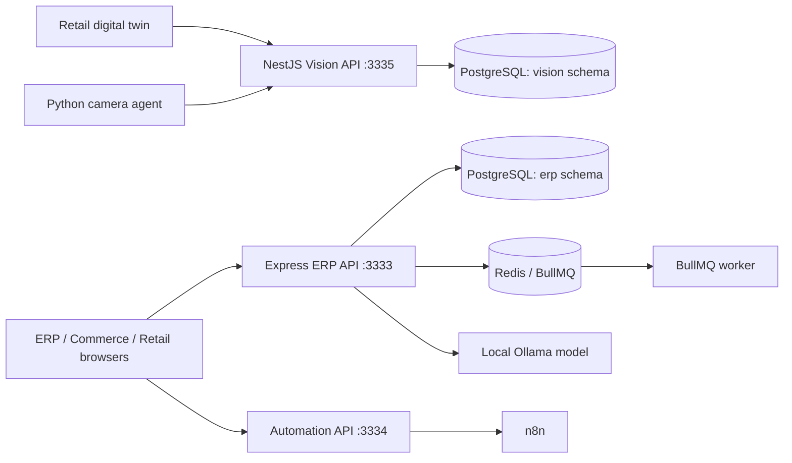

# Architecture Plan

Status: living architecture reference  
Last updated: 2026-08-15

## 1. Purpose

This document records the architecture that exists today and the planned changes needed to make the platform production-ready. Items marked **Current** are implemented in the repository. Items marked **Target** are proposals and must not be treated as delivered functionality.

The principal architectural choice is to retain a modular monolith for transactional ERP behavior. The ERP API owns synchronous business transactions, while independently deployable workers, automation, commerce, and computer-vision processes integrate through explicit APIs, contracts, queues, and separate composition roots.

## 2. Goals and quality attributes

The platform is optimized for:

1. Financial and inventory correctness before throughput.
2. Strict company, branch, role, and self-service isolation.
3. Arabic-first usability with complete English and RTL/LTR support.
4. Traceable mutations through audit records, immutable postings, and idempotent commands.
5. Operation on a developer workstation, trusted LAN, or production server without changing domain behavior.
6. Incremental scaling without prematurely splitting transactional domains into microservices.

## 3. Current system topology

**Current:**

- Nx is the build and dependency orchestration layer.
- `apps/web/erp-interface` is the authenticated ERP React application.
- `apps/web/ecom-interface` is the commerce storefront.
- `apps/web/retail-ms-interface` provides retail management and the digital twin.
- `apps/api/erp-api` is the Express composition root for ERP transactions and reporting.
- `apps/workers/jobs-worker` processes BullMQ jobs and exposes no HTTP business API.
- `apps/automation/automation-api` integrates with n8n.
- `apps/services/vision-service` and `vision-camera-agent` form a separately deployable tracking subsystem.
- PostgreSQL is the business system of record. Redis is transport and coordination infrastructure, not authoritative storage.

## 4. Domain boundaries and ownership

| Domain | Owning code | Authoritative data and responsibility |
| --- | --- | --- |
| Identity and access | ERP API `auth`, `roles`; shared frontend auth | Users, sessions, built-in/custom roles, permissions, company and branch scope |
| HR | ERP API `hr` | Employees, departments, employment details |
| Attendance | ERP API `attendance` | Shifts, attendance records, employee portal operations |
| Payroll | ERP API `payroll` | Payroll runs, employee lines, allowances, deductions, approval/payment state |
| Catalog and parties | `catalog`, `master-data`, `parties` | Products, categories, units, customers, and suppliers |
| Purchasing and inventory | `purchasing`, `inventory` | Purchase orders, receipts, warehouses, stock movements, balances |
| Sales and CRM | `sales`, `crm` | Invoices, payments, returns, customer activity |
| Accounting and finance | `accounting`, `finance` | Journals, periods, accounts, expenses, cash/bank movements, reconciliation |
| Reporting | `reports` | Read models and tenant-scoped aggregation over authoritative ERP tables |
| Commerce | `commerce`, `storefront`, `libs/domains/commerce` | Storefront-facing catalog contracts and commerce application boundaries |
| Jobs | shared backend job libraries and worker | Typed asynchronous execution; PostgreSQL remains the source of truth |
| Vision | Vision Service and camera agent | Store tracking data in the separate `vision` schema |

Domain modules may read another domain through an explicit application/API boundary. Cross-domain writes that affect stock, money, or payroll must be coordinated by one server-side transaction rather than frontend request chaining.

## 5. Data and transaction model

**Current:**

- ERP tables are isolated in the PostgreSQL `erp` schema; Vision uses `vision`.
- Database changes are forward migrations tracked by `schema_migrations`.
- Business queries are scoped by `company_id`; branch-scoped access additionally follows user assignments and warehouse-to-branch relationships.
- Financial decimal values cross API boundaries as strings to avoid floating-point corruption.
- Receipt and other retry-prone commands use idempotency keys where implemented.
- Payroll payment creates the related financial movement as part of the server-side lifecycle.
- Departments, shifts, and custom roles use guarded deletion/archive behavior when referenced.

**Target:**

- Define database-level invariants and transaction tests for every stock, journal, payment, and payroll state transition.
- Add a transactional outbox before queues are used for correctness-critical dual writes.
- Introduce retention and archival policies for audit, attendance, report exports, and vision events.
- Document restore procedures and rehearse backups for both PostgreSQL schemas.

## 6. API and contract rules

- HTTP routes are rooted at `/api`; Vision routes are rooted at `/api/v1`.
- Authentication and authorization are enforced on the server. Frontend guards improve UX but are never the security boundary.
- Request validation uses Zod or service-level DTO validation. Errors must use the shared response shape and include a safe user-facing message.
- The frontend data-access layer displays API success/error messages through the shared toast host.
- List endpoints must remain company-scoped and apply branch/self scope before pagination and aggregation.
- Breaking contract changes require a migration path or a versioned route. Shared contracts must remain framework-independent.
- API logs must contain correlation identifiers and operational context, but never passwords, tokens, payroll amounts, or unnecessary personal data.

## 7. Identity, permissions, and security

**Current:**

- JWT identity includes tenant/company context.
- Database role-permission mappings are authoritative.
- Custom roles and their permissions are company-isolated; delegation checks prevent administrators from granting authority they do not hold.
- Built-in roles are protected and custom roles in use cannot be deleted.
- Employee users are restricted to `/attendance-portal`; self-service data must be constrained to the authenticated employee.
- Helmet, CORS, request validation, and API authorization middleware are enabled.

**Target before public exposure:**

- Rotate refresh tokens and store browser sessions in secure, `HttpOnly`, `SameSite` cookies.
- Add rate limits per authentication and sensitive mutation route, account lockout policy, and security-event monitoring.
- Require strong production secrets, TLS, restricted database accounts, and an explicit CORS allowlist.
- Add automated negative tests for cross-company, cross-branch, privilege-escalation, and employee self-service access.

The detailed permission map is maintained in [access-control.md](access-control.md).

## 8. Critical workflows

| Workflow | Required invariant |
| --- | --- |
| Procure to stock | Only approved purchase orders may be received; receipt is idempotent and atomically updates stock/accounting boundaries |
| Order to cash | Invoice totals, inventory deduction, customer balance, payment, and return effects cannot partially commit |
| HR onboarding | Employee identity, department, shift, user account, and role assignment remain explicitly linked and auditable |
| Attendance | An Employee may see and mutate only the permitted self-service attendance operation |
| Payroll | Draft → approved → paid is enforced server-side; paid runs cannot be silently recalculated |
| Reporting | Filters and aggregates apply company/branch scope before returning or exporting results |

## 9. Deployment model

### Developer workstation and trusted LAN

The ERP frontend runs on port `5173` and the ERP API on `3333`. LAN use binds Vite to `0.0.0.0`, permits both ports through a Private Windows Firewall profile, and accesses the frontend through the computer's Wi-Fi IPv4 address. This is for trusted development networks only.

### Production target

- Serve compiled frontend assets behind a TLS reverse proxy with SPA fallback.
- Run the ERP API, worker, automation API, and Vision Service as separate supervised processes/containers.
- Use managed or hardened PostgreSQL and Redis instances on private networks.
- Run migrations once as a gated deployment step before application rollout.
- Provide health/readiness probes, structured logs, centralized metrics, encrypted backups, and a tested rollback procedure.
- Do not expose Vite development servers, PostgreSQL, Redis, Ollama, or camera endpoints to the public internet.

See [vps-deployment.md](vps-deployment.md) for operational commands.

## 10. Known gaps and risks

| Area | Current limitation | Planned response |
| --- | --- | --- |
| Payroll compliance | Core workflow exists, but country-specific tax, insurance, leave, overtime, and labor-law rules are not a certified payroll engine | Add effective-dated policy tables, calculation versions, approvals, and jurisdiction tests |
| Reports | Expiry data lacks product-lot expiry dates; leave records are not modeled; overtime is estimated above eight hours | Add lot/expiry and leave domains; replace estimates with approved policy calculations |
| Branch analytics | Some inventory/reporting scope relies on warehouse-to-branch relationships | Make branch ownership mandatory and test all aggregates |
| Async correctness | Queue publishing is not backed by a transactional outbox | Add outbox, relay, deduplication, retry, and reconciliation dashboards |
| Security | Token/session hardening is incomplete for public deployment | Complete the controls in section 7 before internet exposure |
| Frontend scale | ERP interface is broad and can produce large bundles | Introduce route-level lazy loading and bundle budgets |
| Test coverage | Builds and type checks cover structure, but critical workflows need broader integration and authorization regression suites | Add database-backed API tests and browser smoke tests to CI |

## 11. Delivery roadmap

### Phase 0 — Baseline and safeguards

- Keep README, architecture, access-control, migration, and deployment documents synchronized.
- Gate changes on lint, type checking, tests, production builds, and migration verification.
- Add trace/correlation IDs and consistent structured errors across all services.

### Phase 1 — Business correctness

- Complete leave, product lot/expiry, branch ownership, and payroll policy models.
- Add transaction and invariant tests for purchase receipt, invoice, payment, return, payroll approval, and payroll payment.
- Remove report estimates once authoritative data exists.

### Phase 2 — Reliability and operations

- Implement the transactional outbox and job reconciliation.
- Add metrics for API latency/errors, queue depth/retries, database saturation, failed logins, report duration, and payroll failures.
- Automate backup verification, restore drills, migration checks, and rollback releases.

### Phase 3 — Production security

- Complete session hardening, secret rotation, rate limits, least-privilege service accounts, TLS, dependency scanning, and tenant-isolation tests.
- Perform an authorization review and production readiness assessment before public launch.

### Phase 4 — Evidence-based scaling

Keep the ERP transactional core modular. Extract a domain into a separate service only when ownership, deployment frequency, scaling profile, or failure isolation provides measurable benefit. Any extraction must define its system of record, contract versioning, consistency model, reconciliation process, and rollback plan first.

## 12. Proposed operational targets

These are targets, not current service-level guarantees:

- Monthly ERP API availability: 99.9%, excluding announced maintenance.
- Typical read request p95: below 500 ms; complex report p95: below 5 seconds for the supported data envelope.
- Recovery point objective: 15 minutes. Recovery time objective: 2 hours.
- Zero accepted cross-company data exposure and zero unbalanced posted financial transactions.
- Alert on sustained API error rate, database connection exhaustion, queue backlog, repeated job failure, failed migration, and backup verification failure.

## 13. Architecture decisions and review triggers

Record material decisions as short ADRs under `docs/adr/` when they change data ownership, service boundaries, authentication, consistency, or deployment. Revisit this plan when:

- A module needs independent scaling or deployment.
- A cross-domain transaction can no longer fit safely in one database transaction.
- Tenant or branch isolation rules change.
- A new jurisdiction changes payroll/accounting obligations.
- Recovery, latency, or throughput targets are missed repeatedly.

## 14. Definition of done for architecture-impacting work

An architecture-impacting feature is complete only when its ownership and source of truth are explicit; authorization scope and audit events are tested; migrations and rollback/forward-fix paths exist; failure and retry behavior is defined; logs and metrics are safe and useful; documentation and API contracts are updated; and lint, typecheck, tests, and production builds pass.
